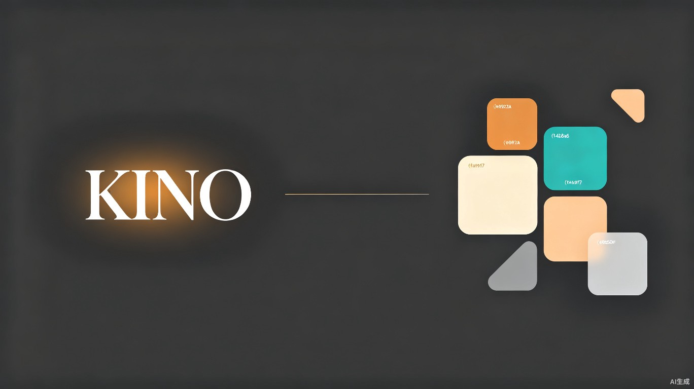

<p align="center">
  
</p>

<h1 align="center">Kino Design System</h1>

<p align="center">
  以天气为灵感的主题式设计系统<br>
  中文 | <a href="README_EN.md">English</a>
</p>

---

## 简介

Kino 是一套以天气现象命名的主题式设计系统，采用 Monorepo 结构统一管理多种视觉风格变体。每个风格变体（Style）都是一套完整独立的设计系统，包含 Token、组件、预览和文档。

当前首套风格 **Twilight（暮光）** 已发布，定位为暗色电影感仪表盘设计系统，适用于影视信息数据库等数据密集型产品。

## 风格一览

| 风格 | 版本 | 描述 | 色调 |
|---|---|---|---|
| [Twilight（暮光）](styles/twilight/) | v1.0.0 | 暗色电影感仪表盘，温暖沉稳 | 琥珀 `#e8922a` + 青色 `#14b8a6`，暖色深色底 |

### 路线图

| 风格 | 定位 |
|---|---|
| Dawn（晨曦） | 明亮、乐观的色调，适合营销与落地页 |
| Frost（霜冻） | 冷峻、清晰的色调，适合数据密集型分析工具 |
| Aurora（极光） | 多彩渐变色调，适合创意与媒体应用 |
| Thunder（雷暴） | 高对比度、大胆色调，适合运维与管理后台 |

## UI Kit 展示

**Twilight — Dashboard 仪表盘**

<p align="center">
  
</p>

## 仓库结构

```
kino/
├── assets/                          # README 图片资源
├── styles/
│   └── twilight/                    # 每个风格是一个完整的设计系统
│       ├── tokens/
│       │   ├── colors_and_type.css  # CSS 自定义属性（唯一真相源）
│       │   └── css.json             # 结构化 Token 数据
│       ├── components/
│       │   ├── index.json           # 组件索引
│       │   └── {slug}.json          # 组件契约定义
│       ├── preview/
│       │   └── component-{slug}.html # 组件预览卡片
│       ├── ui_kits/
│       │   └── dashboard/index.html # 交互式 UI Kit
│       ├── README.md                # 风格文档（中文）
│       ├── README_EN.md             # 风格文档（英文）
│       └── SKILL.md                 # AI 可消费的技能卡片
└── shared/                          # (计划中) 公共资源
```

## 使用方式

### 引入 CSS 变量

```html
<link rel="stylesheet" href="styles/twilight/tokens/colors_and_type.css">
```

所有组件和页面通过 CSS 变量消费设计 Token，例如 `var(--color-primary)`、`var(--radius-md)`、`var(--space-4)`。

### 工具链消费

```js
import tokens from './styles/twilight/tokens/css.json';
// 可用于生成 Tailwind 配置、CSS-in-JS 主题、Figma 变量等
```

### 组件契约

`components/{slug}.json` 定义了每个组件的：
- 变体维度（variant dimensions）和代表性变体
- 结构剖析（anatomy）和使用场景
- AI 置信度评级

## 设计理念

- **简洁克制** — 风格简约化，信息密度中等，不堆砌视觉元素
- **暗色优先** — 暗色底色营造电影感氛围，适合长时间数据浏览
- **Apple 式美学** — 极微妙阴影、充足留白、精致排版
- **暖中性基调** — 避免冷灰色调，以温暖中性和琥珀色为主调

## 贡献

1. 创建新风格分支：`git checkout -b style/dawn`
2. 在 `styles/` 下遵循现有目录结构
3. 确保 `tokens/colors_and_type.css` 为唯一真相源
4. 所有颜色值使用 6 位 hex 或 rgba() 格式

## 许可证

MIT
